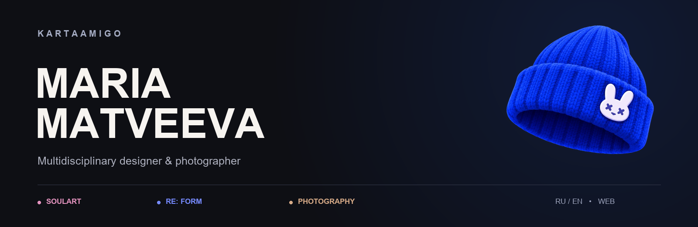
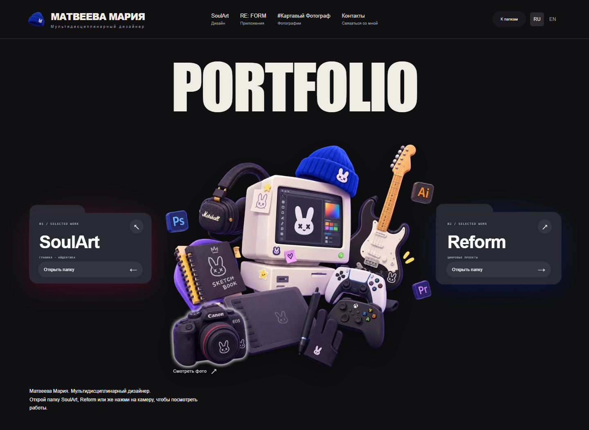

<div align="center">

[](https://kartaamigo.github.io/)

**Дизайн, фотография и цифровые проекты Марии Матвеевой.**

[Открыть сайт ↗](https://kartaamigo.github.io/) · [English version ↗](https://kartaamigo.github.io/index.en.html) · [Написать мне ↗](https://kartaamigo.github.io/personal-portfolio-concept/contacts.html)

</div>

---

## Три направления. Один автор.

| SoulArt | RE: FORM | Картавый фотограф |
| :--- | :--- | :--- |
| Графический дизайн и визуальная коммуникация. | Цифровые продукты и авторские проекты. | Фотография и работа с изображением. |
| Айдентика, обложки, постеры, вёрстка журналов и книг. | UI/UX, дизайн сайтов, интерфейсы и эксперименты. | Съёмки, серии и визуальные истории. |

## Внутри сайта

[](https://kartaamigo.github.io/)

Русская и английская версии, адаптация для телефона, проекты с подробными кейсами и отдельная страница контактов. Сообщение можно отправить прямо с сайта.

## Работы

| Проект | Направление |
| :--- | :--- |
| [Journal](https://www.behance.net/gallery/229126569/Journal-Full-fledged-layout-of-the-magazine) | Вёрстка журнала |
| [RE: FORM LIFE](https://www.behance.net/gallery/256292513/Demo-version-of-the-project-RE-FORM-LIFE) | Цифровой проект |
| [XFit Rebranding](https://www.behance.net/gallery/249997653/XFit-Rebranding) | Айдентика и ребрендинг |
| [Brand Book GxSoul/KRTY](https://www.behance.net/gallery/246885793/Brand-Book-GxSoulKRTY) | Фирменный стиль и брендбук |

Ещё больше работ - на [Behance](https://www.behance.net/tuumiyurmirazh).

## На связи

[Telegram](https://t.me/designeramigo) · [Почта](mailto:xghostxsoulx@gmail.com) · [WhatsApp](https://wa.me/79775243501)

[Behance](https://www.behance.net/tuumiyurmirazh) · [GitHub](https://github.com/kartaamigo) · [Pinterest](https://ru.pinterest.com/x1ghostxsoul1x/)

<details>
<summary><strong>Как устроен сайт</strong></summary>

Статический сайт на HTML, CSS и JavaScript, опубликованный через GitHub Pages. Шрифты и изображения хранятся вместе с сайтом; сборка и установка зависимостей для запуска не нужны.

**Опубликованная версия находится в ветке [`gh-pages`](https://github.com/kartaamigo/kartaamigo.github.io/tree/gh-pages).** GitHub Pages использует корень этой ветки. Ветка `main` содержит более раннюю версию и описание проекта.

```text
index.html                    Главная страница на русском
index.en.html                 Главная страница на английском
personal-portfolio-concept/   Разделы, стили и интерактивные элементы
dual-world/                   Визуальное оформление
shared-fonts/                 Локальные шрифты и их лицензии
favicon.ico                   Значок сайта
robots.txt · sitemap.xml      Файлы для поисковых систем
```

Для локального просмотра опубликованной версии:

```bash
git clone --branch gh-pages https://github.com/kartaamigo/kartaamigo.github.io.git
cd kartaamigo.github.io
python -m http.server 8080
```

Откройте `http://localhost:8080/`.

Исходные лицензии шрифтов находятся в `shared-fonts`. Работы и авторские изображения принадлежат их правообладателям; этот репозиторий не предоставляет разрешение на их повторное использование.

</details>

---

<div align="center">

**KARTAAMIGO** · Maria Matveeva

[kartaamigo.github.io](https://kartaamigo.github.io/)

</div>
